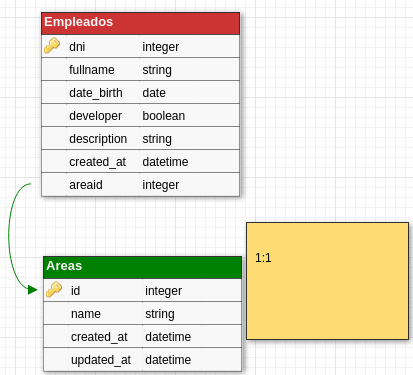

# GOTAM

GOTAM es una aplicación CRUD que permite mostrar, dar de baja y dar de alta empleados

## Instalación
1. Clone repo
 Opcion 1 GIT:

```bash
git clone https://github.com/fgiolli/gotam.git
```
Opcion 2: 
[Descargar](https://github.com/fgiolli/gotam/archive/refs/heads/main.zip)

2. Install npm packages

Dentro de la carpeta raíz utilizar
```bash
npm install && cd client && npm install
```

## Iniciar aplicación

Desde la carpeta raíz de gotam
**NOTA: Es necesario que configures la conexión a la base de datos desde un .env, la base de datos que usará es gotam.. podes crearla con estas query [sql](gotam.sql) 
```bash
DBHOST=tuhost
DBUSER=usuario
DBPASS=contraseña
```

1.Backend
```bash
node server.js
```

2.Frontend
```bash
cd client && ng build
```

## DER, Diagrama de entidad-relacion


## API Usage
1. Empleados

1.1 GET: Obtiene una lista con todos los empleados.

```bash
/api/empleados
```

1.2 POST: Permite crear o dar de alta un empleado.
```bash
/api/empleados
```
El cuerpo debe tener las siguientes propiedades
```bas
fullname (string), dni (int), date_birth(date (YYYY-MM-DD)), developer (string), description (string), areaID (int)
```
Incluir las propiedades en el cuerpo de la peticion.

1.3 PUT: Permite actualizar los valores de un (id) empleado.
```bash
/api/empleados/:id
```
Parametro id: ID empleado.


1.4 DELETE: Permite eliminar un empleado
```bash
/api/empleados/:id
```
Parametro id: ID empleado.

## Paquetes utilizados
Backend:
```bash
cors: ^2.8.5,
dotenv: ^10.0.0,
express: ^4.17.1,
mysql2: ^2.2.5,
sequelize: ^6.6.5
```
Frontend:
```bash
Angular: 12
```